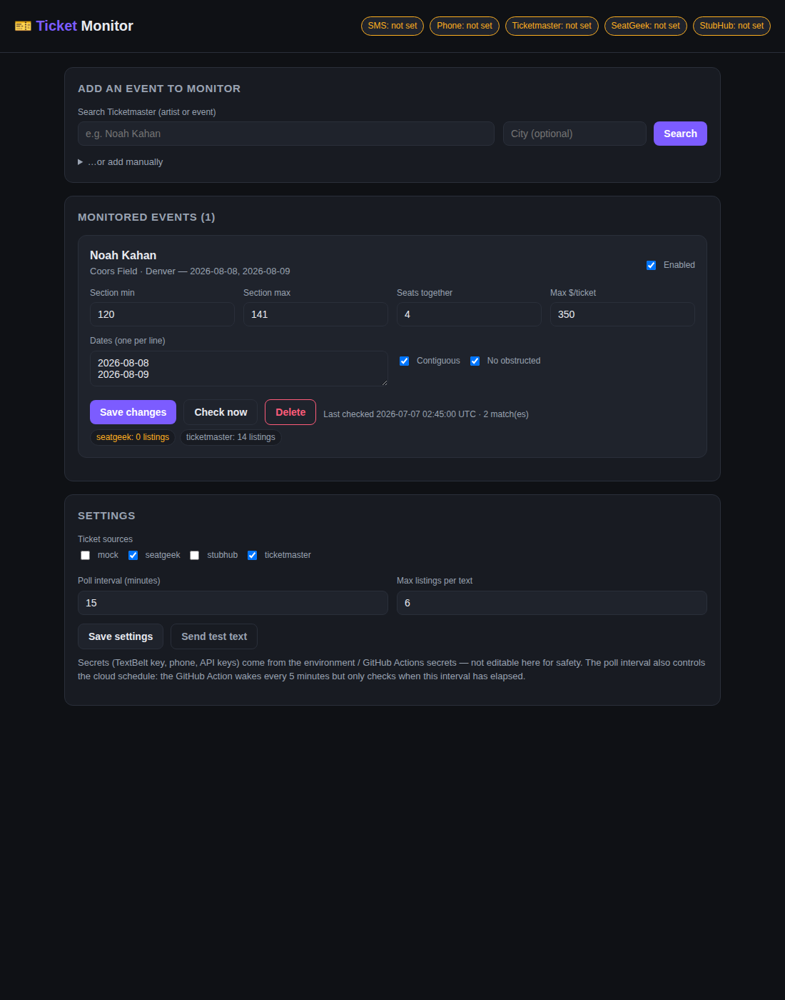

# Noah-Kahan-Tixkets

An agent that watches resale/primary ticket sources for **Noah Kahan — _The Great
Divide Tour_ at Coors Field, Denver (Aug 8 & 9, 2026)** and **texts your phone**
when 4 seats together come up in the lower bowl under your price.

It looks for listings that meet **all** of your rules:

- 🎟️ **4 seats next to each other** (contiguous)
- 📍 **Lower bowl, sections 120–141**
- 💵 **At or below your price** (starts at **$350/ticket**, configurable)
- 🚫 **No obstructed / limited-view seats**
- 🗓️ **Either show** — Aug 8 or Aug 9, 2026

When something qualifies, you get a text like:

```
🎫 Noah Kahan Aug 8 @ Coors Field: 2 seat(s) under target!
• Sec 120 Row 3 x6 @ $289/ea (seatgeek)
• Sec 128 Row 12 x4 @ $312/ea (ticketmaster)
https://…link-to-cheapest-listing…
```

It remembers what it already told you, so you only get pinged for **new**
listings or when a price **drops** further.

You can monitor **as many events as you like** — the Noah Kahan shows are just
the starting point. A built-in **web UI** lets you add concerts, edit prices and
seat sections, and turn events on/off without touching any files.

---

## Manage events with the web UI

```bash
pip install -r requirements.txt -r requirements-web.txt
python -m webui                     # → http://127.0.0.1:5000
```

From the UI you can:

- 🔎 **Search for a concert** (Ticketmaster) and click **Monitor this**, or add
  one manually (artist, venue, city, dates).
- ✏️ **Edit price, section range, seat count**, and the contiguous / no-obstructed
  rules per event — changes save straight to `watches.json`.
- ⏯️ **Enable/disable** events and **Delete** ones you no longer care about.
- 🧪 **Check now** to preview which listings currently match (a dry run — no text
  sent).
- ⚙️ Toggle which ticket **sources** to use and the poll interval (which also
  drives how often the cloud runs check).
- 📲 **Send a test text** to confirm SMS wiring, with your remaining TextBelt
  credit shown alongside.



Everything the UI edits lives in [`watches.json`](./watches.json), which the
agent reads. Edit events in the UI locally, then `git commit` + `git push` so the
scheduled GitHub Action picks up your changes.

---

## Quick start (run once locally)

```bash
pip install -r requirements.txt
cp .env.example .env          # then edit .env with your keys/phone
set -a && . ./.env && set +a  # load .env into the environment
python -m monitor --dry-run   # prints the text instead of sending it
```

This checks **every event in your watchlist** (`watches.json`). Drop `--dry-run`
to actually send SMS, or add `--loop` to keep polling.

```bash
python -m monitor             # check the whole watchlist once
python -m monitor --loop      # poll on the configured interval
python -m monitor --config config.yaml   # legacy single-event mode
```

## Recommended: run it in the cloud on a schedule (GitHub Actions)

No machine to keep on. The included workflow
(`.github/workflows/monitor.yml`) runs every ~15 minutes and holds your
credentials as encrypted secrets.

1. Push this repo to GitHub.
2. Go to **Settings → Secrets and variables → Actions → New repository secret**
   and add:

   | Secret | Required? | Where to get it |
   | --- | --- | --- |
   | `TEXTBELT_KEY` | ✅ yes | https://textbelt.com (buy credits; or `textbelt_test` to trial) |
   | `ALERT_PHONE` | ✅ yes | your mobile, e.g. `+14044443292` |
   | `TICKETMASTER_API_KEY` | recommended | free at https://developer.ticketmaster.com |
   | `SEATGEEK_CLIENT_ID` | optional | free at https://platform.seatgeek.com |
   | `STUBHUB_TOKEN` | optional | https://developer.stubhub.com (partner approval) |
   | `TM_WEB_CONSUMER_KEY` | optional | only if the seat-map stage reports it's blocked — copy the `apikey` ticketmaster.com sends in its own seat-map request (browser dev tools → Network tab) |

3. **Verify texting works**: Actions tab → **Noah Kahan ticket monitor** →
   **Run workflow** → tick **"Just send a test text"**. Your phone should buzz
   within a minute.
4. **Verify ticket data**: run it again with **"dry run"** ticked and read the
   run's logs — you'll see what each source returned for each event.
5. Done — it now runs automatically on the schedule and checks your whole
   watchlist.

### How the schedule works

The workflow wakes every ~5 minutes, but only actually checks when the
**poll interval** you set in the web UI (default 15 min) has elapsed — so you
can speed up to 5-minute checks the week of the show by changing one number in
the UI, no workflow edits needed.

After each meaningful run, the workflow **commits status back** to
`watches.json` (match counts, per-source listing counts, errors) — so when you
pull and open the web UI, you see exactly what the cloud runs are seeing.
Timestamp-only changes are skipped to keep git history clean. Run
`git pull` before editing the watchlist locally to avoid conflicts.

## Changing what it looks for

The easiest way is the **web UI** (above) — edit price, sections, seats, and
dates per event with live "check now" feedback.

Under the hood every event and its criteria live in
[`watches.json`](./watches.json), which you can also edit by hand:

```json
{
  "watches": [
    {
      "artist": "Noah Kahan", "venue": "Coors Field", "city": "Denver",
      "dates": ["2026-08-08", "2026-08-09"],
      "section_min": 120, "section_max": 141,
      "min_quantity": 4, "max_price_per_ticket": 350,
      "require_contiguous": true, "exclude_obstructed": true, "enabled": true
    }
  ],
  "providers": { "seatgeek": true, "ticketmaster": true, "stubhub": false },
  "runtime": { "poll_interval_minutes": 15, "max_matches_in_text": 6 }
}
```

Commit and push after editing; the next scheduled run uses the new values.
(The legacy single-event `config.yaml` + `python -m monitor --config config.yaml`
path still works if you prefer it.)

## How the sources work (and their limits)

The agent is **provider-agnostic** — it merges listings from every enabled
source, then applies your filters. Honest notes on each:

| Source | Key needed | Seat-level detail |
| --- | --- | --- |
| **Ticketmaster** | free API key | Discovery API confirms the events + price ranges; the public seat-map endpoint adds **per-section** cheapest price & availability. This is the main workhorse. |
| **SeatGeek** | free client id | Public API gives event-level lowest price; full per-seat listings need a partner key. Parses seat-level data when your key returns it. |
| **StubHub** | partner token | Richest seat-level data (section, row, seat numbers, obstructed flag) — but requires approved developer access. Off by default. |
| **mock** | none | Sample data in `data/sample_listings.json` for testing/demo. |

> **Note for The Great Divide Tour specifically:** Noah Kahan is using
> Ticketmaster's **Face Value Exchange** — tickets are non-transferable and can
> only be resold *on Ticketmaster at face value*. That's great news for your
> price target (no scalper markup), but it means secondary markets (StubHub,
> SeatGeek) will have little or no inventory for these shows. **Ticketmaster is
> the source that matters here**, and seats reappear on it whenever fans return
> them at face value.

Each event card in the web UI shows **per-source health** after every check
(e.g. `ticketmaster: 14 listings · seatgeek: 0 listings`) so you can see at a
glance whether a source is actually returning data or erroring.

Two honest caveats baked into the design:

- **Contiguity:** when a source exposes seat numbers we verify a run of 4
  consecutive seats. When it only exposes section-level availability
  (Ticketmaster facets), “4 together” is approximated by “≥4 available in that
  section.” StubHub gives true seat numbers.
- **Obstructed view:** excluded via an explicit flag when the source provides
  one, plus a keyword scan of listing notes (“obstructed”, “limited view”,
  “behind pole”, …).

If a source is unconfigured or errors, it’s skipped — one bad source never
stops the others.

## Project layout

```
monitor/
  __main__.py        CLI (watchlist run / --loop / --dry-run / --config)
  agent.py           orchestrate: fetch → filter → dedupe → text (single + watchlist)
  watch.py           multi-event watchlist model + JSON store
  config.py          load config.yaml + env secrets
  models.py          Listing data model
  filters.py         the matching rules (section/price/contiguous/obstructed)
  state.py           dedupe store (don't re-text the same seats)
  notifier.py        TextBelt SMS
  providers/         seatgeek, ticketmaster, stubhub, mock
webui/
  app.py             Flask JSON API (watches CRUD, check-now, search, settings)
  __main__.py        `python -m webui` launcher
  templates/index.html   single-page UI
watches.json         your monitored events (edited by the UI)
scripts/status_changed.py   lets the workflow commit meaningful status back
data/sample_listings.json   demo data for the mock provider
tests/               pytest suite (filters, state, notifier, watchlist, web API, e2e)
.github/workflows/monitor.yml   scheduled cloud runner
```

## Tests

```bash
pip install -r requirements-dev.txt
pytest -q
```

## Notes

- TextBelt and the ticket APIs cost a little money / are rate-limited; the
  15-minute cadence and dedupe keep usage low.
- This tool only **notifies** — it does not buy tickets. Follow the link in the
  text to purchase.
